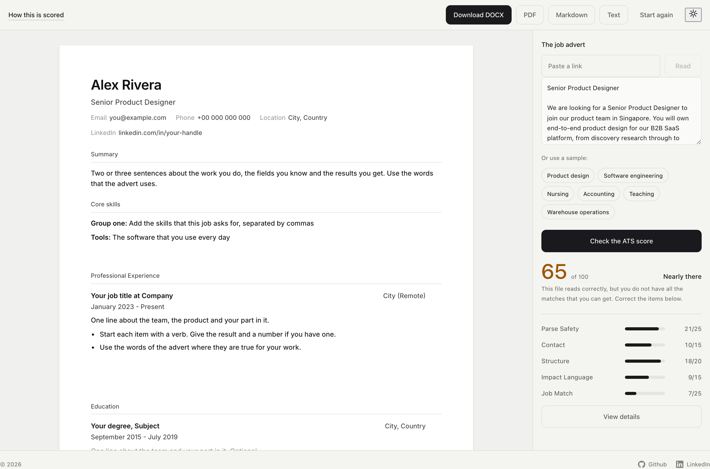

# ATS CV Scoring

**Write your CV here, and see the score that hiring software gives it.**

Most companies put your CV through software before a person sees it. The software must
get your name, your email address, your job titles and your dates out of the file. If it
cannot do this, your data goes into the incorrect field or into no field. Nobody tells
you the reason.

A design tool makes this worse. It can export a PDF that shows the letters as drawings,
with no text below them. The page looks correct and reads as nothing.

This tool removes that risk. You write the CV here, in a document on the page. The file
comes from the same data each time, thus it always has real text. The panel at the side
gives the score and explains each point.



---

## Your CV stays on your computer

This matters, so it comes first.

**Your CV never leaves your computer.** There is no account, no sign-up, no tracking, no
analytics, and nothing is stored anywhere.

This is the exact operation, because a statement about privacy is easy to make:

- **You write the CV in your browser and it stays there.** The tool keeps it in the
  local store of the browser, on this computer. It sends nothing to any other place. You
  can disconnect the internet and the tool operates.
- **The score is calculated in the browser too.** No text goes to a server for it.
- **Only one thing goes to the internet:** a link to a job advert. This occurs only when
  you put in a link and press the button. Your CV is not part of that request.
- **To remove the CV**, press "Start again", or clear the site data of your browser.

This is a test, not a statement. `scripts/check-privacy.mjs` operates the full tool in a
browser. It puts a marker string in the CV, records each network request of the page, and
fails if a request goes to a different machine or contains the marker. You can run it:

```bash
npx playwright install chromium   # one-off
npm run dev                       # in another terminal
npm run check:privacy
```

---

## What you need first

You need one free program: **Node.js**. It permits your computer to run this type of
project. You do not have to know more about it.

1. Go to **[nodejs.org](https://nodejs.org)**
2. Download the version with the label **LTS**. This is "long term support", the stable version.
3. Open the downloaded file and click through the installer, accepting the defaults

That is the only thing you need to install.

---

## Getting it running

You will use a program with the name **Terminal**. It is a window where you type
commands. You do not click buttons. Your computer includes this program.

**To open it:**

- **Mac**: press `Cmd` + `Space`, type `Terminal`, then press Enter
- **Windows**: press the Start button, type `PowerShell`, then press Enter
- **Linux**: press `Ctrl` + `Alt` + `T`

Do these four steps. **Type each line, then press Enter.** Wait for each step to
complete before you start the next step.

### Step 1. Download this project

```bash
git clone https://github.com/itsbyferdi/ATS.git
```

If you get an error about `git`, download the project as a folder. Click the green
**Code** button at the top of this page on GitHub. Then select **Download ZIP** and open
the ZIP file.

### Step 2. Go into the project folder

```bash
cd ATS
```

`cd` is "change directory". This command gives the folder to the terminal.

### Step 3. Install the parts

```bash
npm install
```

This command downloads the parts that the project uses. It takes one or two minutes and
writes much text. This is correct. Some warnings are also correct.

### Step 4. Start the tool

```bash
npm run dev
```

You will see something like:

```
➜  Local:   http://localhost:5173/
```

**Open that address in your web browser.** The tool is now running.

> **Do not close the terminal window** while you use the tool. If you close it, the tool
> stops. To stop the tool, click the terminal and press `Ctrl` + `C`.
>
> **The next time**, do only steps 2 and 4. You install the parts one time only.

---

## Using it

The screen has two parts.

### On the left: your CV

The white sheet is the document. Click any line and change it. There is no separate form
and no preview, because the sheet is the file that you send.

- **Enter** in a list makes the next item. **Backspace** on an empty item removes it.
- The controls that add a part are always visible and say what they add. The controls
  that move or remove a part appear when the pointer is on that part, or the caret is
  in it, because those change what you already wrote.
- A part that you add gets the caret, so you can write in it at once.
- A paste keeps the words and discards the formatting, because formatting from another
  program is the thing that breaks a CV.
- The document stays in this browser. Nothing goes to a server.

The editor shows one A4 page at a time, at the size the page prints. The arrows below
the sheet move between the pages. Three pages is the limit, and the editor says so when
your CV runs past it.

**Download** at the top saves the file. The chevron opens the list:

| File | Use it for |
|---|---|
| **Word (.docx)** | Application forms. Programs read this format most reliably. |
| **PDF** | Email and your own records. Your browser prints it, thus it has real text. |
| **Markdown (.md)** | A copy in a repository. |
| **Plain text (.txt)** | The exact text that a hiring program reads. |

### On the right: two tabs

**ATS score** holds the number and the five groups behind it. **Job description** holds
the advert: put it in the box, or give a link and press **Read**. There are also sample
adverts from six fields.

Press **Check the ATS score** and you get the number, the band and the five groups of
points. You press it once. After that the score stays current: the number follows the
document while you write.

Press **See every check** for the full breakdown: the fixes worth the most points, the
keywords from the advert that your CV does not use, and each check with the test that it
ran. **How this is scored**, at the foot of the tab, gives the whole rubric and the
places where it stops being true.

With no advert the Job Match group cannot be measured. The four groups that remain carry
75 points between them, and the number you see is that result as a percentage. Add an
advert and the number moves, because it then includes Job Match. **The two numbers
measure different things and do not compare.**

**It works for any job.** The tool reads the advert, finds the applicable field, and
gives a score against the vocabulary of that field: clinical terms for a nursing advert,
accounting terms for an accounting advert. A field with no pack also operates, because
the tool counts the terms that occur many times in the advert.

---

## What the score actually means

To be clear: **this number is ours. It is not the number of a hiring system.**

No hiring system gives a score from 100. Greenhouse puts people into five groups and
states in its documentation that it does not refuse or advance a person by itself.
Workday gives a grade from A to D. A recruiter makes the decision. The employer sets the
weights that put you in order, with controls that you cannot see.

You can also find the statement that systems refuse 75% of CVs. There is no research for
that number. It comes from a company that closed in 2013.

Use this score to compare one version of your CV with your next version, and for nothing
more. One rule is true for each system:

> **If the software cannot get a detail, nobody can search for it.**

The Parse Safety and Contact checks protect this rule. This is the important part.

One more point: no hiring software measures the **Impact Language** group, which covers
verbs and numbers in your items. That group is here because a person reads your CV after
the search, and these are the parts that the person reads.

---

## Common problems

**"command not found: npm"**
Node.js is not installed, or you opened the terminal before you installed it. Close the
terminal, open a new terminal and try again.

**"Port 5173 is in use"**
The tool operates in a different window. Find an address such as `localhost:5174` in the
text and use that address.

**The page is empty, or nothing occurs**
Make sure that the terminal is open and shows the `Local:` address.

**My CV disappeared**
The CV is in the local store of this browser. It is not in your account and it is not on
a server. A different browser, a different computer or a private window shows a new
document. Keep a copy with the Markdown file.

**The link to the advert does not work**
The link reader needs the optional second part. See
[Optional extras](#optional-extras-advanced). Some sites also show the advert only after
you sign in. Copy the text and put it in the box.

**How do I know that the file I send has real text?**
Open the file that you downloaded, press `Ctrl`+`A`, then press `Ctrl`+`C`. Put the
result in a notepad. It must be clear readable text. A file from this tool always passes
that test, because each file comes from the same text.

---

## Optional extras (advanced)

This step is optional. It adds one function to the editor: the tool can read a job
advert from a link. A browser cannot get data from a different site, thus this work
happens in a small program on your own machine.

Open a **second** terminal window, go to the project folder, and run:

```bash
npm run dev:api
```

The web page finds it automatically. The same program also gives an API that reads PDF
and DOCX files with two independent readers and reports a difference between them. The
editor does not use that API. It is there for scripts and for CI. See the API section
below.

---

## Is this safe to run?

Yes. These are the reasons:

- **The tool uploads nothing.** You write your CV in your browser and it stays there.
- **There are no accounts, no tracking and no analytics.** You do not sign up.
- **The project contains no secrets and no keys.**
- **The Inter font is part of the project.** The page does not request a font from
  another site.
- **The optional server listens only to your own computer.** A website cannot reach it.
  If you put the server on the internet, set `ALLOWED_ORIGIN` to your address.
- **The example CV is not a real person.** It contains no data about a real person.

If you find a security problem, please open an issue on GitHub.

---

<details>
<summary><b>For developers</b>: architecture, tests and the reasons for the rubric</summary>

## Layout

```
packages/core   @ats/core   The scoring engine and the CV document. Pure, no runtime deps.
apps/web        @ats/web    React single page. Vite, TypeScript, CSS with design tokens.
apps/api        @ats/api    Express. Optional. It adds the second PDF reader.
```

The engine is deliberately separate from both. Text goes in, a report comes out; it knows
nothing about files, HTTP, or React. That is what makes the rubric testable.

```bash
npm test         # vitest. 111 tests for the engine and the API
npm run typecheck
npm run build
```

Two fixtures drive the tests: text pulled from a two-column PDF, and the single-column
rebuild of the same career. The gap between them is what this project measures.

```
legacy-two-column.txt        43/100   high risk
optimised-single-column.txt  89/100   strong
```

## Scoring

Five groups, 100 points. With no job description Job Match does not apply, the four
remaining groups carry 75 points, and the reported score is that result as a percentage.
`report.score` is therefore always out of 100, and `report.points` / `report.max` hold
the raw total. A score with an advert and a score without one are not comparable.

| Group | Points | Protects | Audience |
|---|---|---|---|
| Parse Safety | 25 | Broken words, reading order, length, unreadable fonts, contact placement | Machine |
| Contact | 15 | Email, phone, location, LinkedIn, portfolio as plain text | Machine |
| Structure | 20 | Section headings, readable dates, newest job first | Machine |
| Impact Language | 15 | Verb-first bullets, numbers, bullet length, filler | Human |
| Job Match | 25 | Keyword coverage, job title, terms in the current role | Both |

### Grounded in real standards

There is no official standard for a "CV score", which is why every online scanner gives
a different number. Two parts of this rubric are grounded in actual standards rather than
guesswork:

- **ISO 32000** (the PDF format). A Type 3 font may store each letter as a small drawing
  program, with nothing requiring it to record which character that drawing represents.
  The tool counts Type 3 fonts and names them as the cause only when it finds them.
- **ISO 14289 / PDF-UA.** A PDF states its reading order in a structure tree. Without
  one, each reader must calculate the order from the position of the text. Thus a side
  column becomes part of your job items. A PDF with no structure tree never gets all the
  points for the reading order.

### Any profession, not just the one it was written for

The vocabulary for each field is in `domains.ts`, in packs: software, design, data,
product, marketing, sales, finance, HR, operations, healthcare, education, legal,
support, writing, science and skilled trades. There is also a `UNIVERSAL` set for each
advert. An advert selects the packs that contain its cues. Thus the tool ranks a nursing
advert with clinical vocabulary and not with design vocabulary. To add a field, add one
entry. You do not have to change anything else. A field with no pack also operates,
because the tool counts unknown terms that occur many times.

### No free points, and no unfair penalties

If a check cannot operate, for example when the tool cannot read a job title from the
advert, the tool removes the check from the total. It does not give half of the points.
The opposite is also true: the check for a link to your work counts only in fields that
expect one. An accountant with no portfolio does nothing incorrect.

## API

```
GET  /api/health
POST /api/extract   multipart/form-data, field "file"  →  text + per-reader diagnostics
POST /api/score     { text, jobDescription?, mutedKeywords?, diagnostics?, engines? }
POST /api/job       { url }  →  { text, source, structured }
```

Send `engines`, which is each reader that operated and not only the best one.
`/api/extract` returns the reader that got the most text. A score from only that reader
hides the condition where a second reader got nothing. That condition is the purpose of
two readers.

`/api/job` reads a job advert from a link. It is the only outbound request this project
makes, which makes it the obvious SSRF target, so: http and https only, DNS resolved and
every address checked against the private, loopback, link-local and CGNAT ranges,
redirects followed by hand with each hop re-checked, a 12-second timeout and a 2 MB cap.
The ranges are unit-tested. Structured `JobPosting` data is preferred where a board
publishes it; otherwise the page text is extracted.

Hardening: CORS is restricted to localhost unless `ALLOWED_ORIGIN` is set, uploads are
capped at 8 MB, text at 400,000 characters, requests at 60/minute per IP, every field is
type-checked, and 500s return a generic message while the detail goes to the server log.

## Design

A warm off-white canvas rather than white, near-black ink rather than black, borders
instead of shadows, one accent, and a 90ms press recoil.

The type is small: 13px base, 12px body copy, 11px for supporting text and 14–15px
section headings. Four controls need correct keyboard operation: the side panel tabs, the
tabs inside the breakdown, the download menu and the two dialogs. They are built on Base
UI, thus the arrow keys move between the items and only the selected item is in the tab
order.

Motion has a short set of rules, and the stylesheet gives the reason wherever it departs
from them. CSS transitions rather than keyframes for anything interactive, so a change
can be interrupted halfway. `transform` and `opacity` only, never a layout property.
`ease-out` in both directions, because `ease-in` holds back the moment a person is
watching. Nothing over 300ms, and 90–130ms for feedback on a press. A theme change turns
every transition off for one frame so the tokens snap instead of smearing, with a wash
over the top. Deleting a part of the document has no animation at all: the one thing you
want from a delete is proof that the thing has gone.

Contrast is checked rather than assumed. The greys and status colours started between
2.6:1 and 4.3:1 at the sizes this app uses, so each is one step darker and now gives more
than 4.5:1. The hues and the order stay the same, and both themes pass at each size.
Colour is never the only source of meaning: each status has an icon and a word, each
focus ring uses the ink colour and not the blue of the browser, and
`prefers-reduced-motion` stops all animation.

</details>

---

## Licence

MIT. You can use, change and share this project. See [LICENSE](LICENSE).
